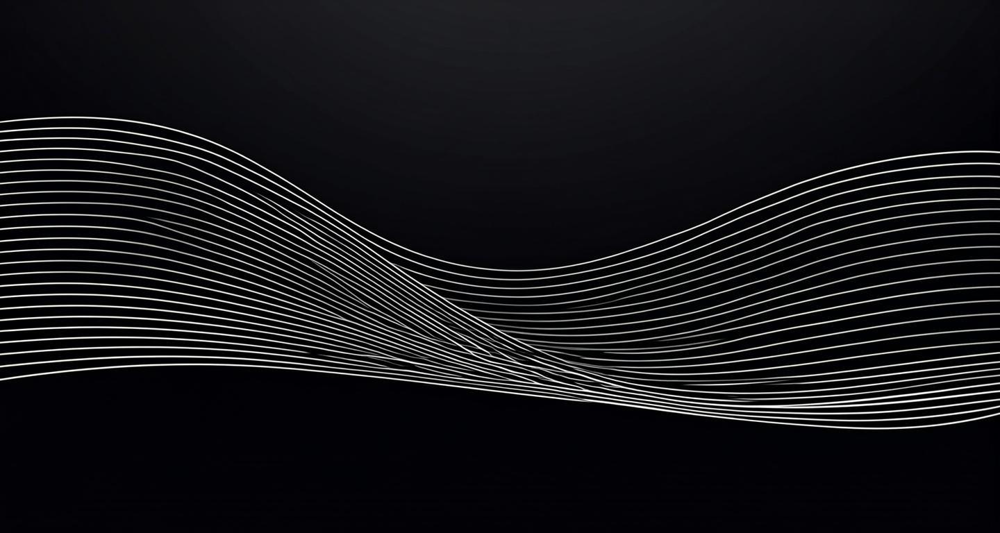
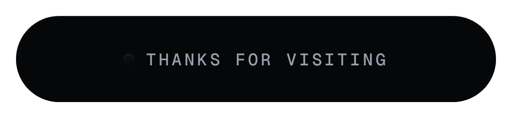

  

# Obscrum

Software developer building computer-use capabilities for AI agents, GPU-accelerated simulation software, and real-time hardware telemetry tools. Working primarily in Python, Kotlin, and C++.

Currently exploring agent orchestration protocols (MCP). Open to professional collaborations and challenging engineering problems.

## Featured Projects

| | |
| --- | --- |
| <a href="https://github.com/Xeakaes/computer-use-for-all-agents"><picture><source media="(prefers-color-scheme: dark)" srcset="https://github-readme-stats-eight-theta.vercel.app/api/pin/?username=Xeakaes&repo=computer-use-for-all-agents&title_color=e6edf3&text_color=9ca3af&icon_color=e6edf3&bg_color=0d1117&border_color=30363d&v=5" /></picture></a> | <a href="https://github.com/Xeakaes/PcHWmonitor"><picture><source media="(prefers-color-scheme: dark)" srcset="https://github-readme-stats-eight-theta.vercel.app/api/pin/?username=Xeakaes&repo=PcHWmonitor&title_color=e6edf3&text_color=9ca3af&icon_color=e6edf3&bg_color=0d1117&border_color=30363d&v=5" /></picture></a> |
| <a href="https://github.com/Xeakaes/AeroVision-CFD"><picture><source media="(prefers-color-scheme: dark)" srcset="https://github-readme-stats-eight-theta.vercel.app/api/pin/?username=Xeakaes&repo=AeroVision-CFD&title_color=e6edf3&text_color=9ca3af&icon_color=e6edf3&bg_color=0d1117&border_color=30363d&v=5" /></picture></a> | <a href="https://github.com/Xeakaes/dlss5-nr-pre-upscale"><picture><source media="(prefers-color-scheme: dark)" srcset="https://github-readme-stats-eight-theta.vercel.app/api/pin/?username=Xeakaes&repo=dlss5-nr-pre-upscale&title_color=e6edf3&text_color=9ca3af&icon_color=e6edf3&bg_color=0d1117&border_color=30363d&v=5" /></picture></a> |

## GitHub Statistics

  <picture>
    <source media="(prefers-color-scheme: dark)" srcset="https://github-readme-stats-eight-theta.vercel.app/api?username=Xeakaes&show_icons=true&include_all_commits=true&count_private=true&title_color=e6edf3&text_color=9ca3af&icon_color=e6edf3&bg_color=0d1117&border_color=30363d&v=5" />
    
  </picture>
  <picture>
    <source media="(prefers-color-scheme: dark)" srcset="https://streak-stats.demolab.com?user=Xeakaes&background=0d1117&border=30363d&ring=e6edf3&fire=e6edf3&currStreakNum=e6edf3&sideNums=9ca3af&currStreakLabel=9ca3af&sideLabels=9ca3af&dates=6e7681&locale=en" />
    
  </picture>

  

